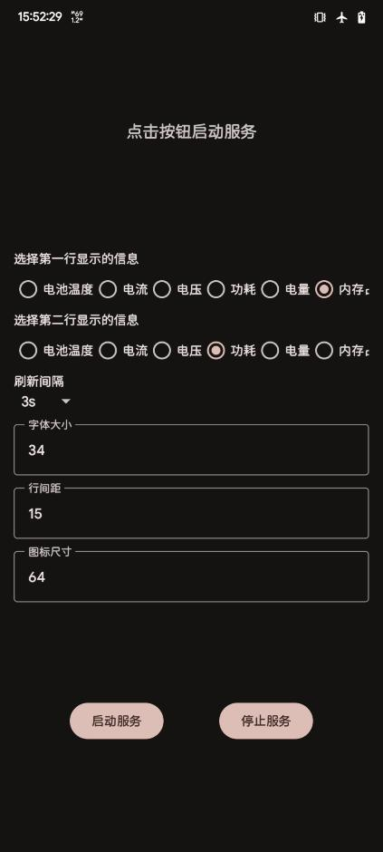

# 状态栏监控 (StatusBarMonitor)

一个简洁、高效的 Android 应用，用于在状态栏实时显示系统信息，如功耗、内存和温度，使用状态栏图标而非悬浮窗，十分适合在AoD上使用。

### 应用截图

---

### 许可证

本项目使用 **MIT 许可证**。详见 [LICENSE](https://www.google.com/search?q=https://github.com/YourUsername/YourRepoName/blob/main/LICENSE) 文件。
