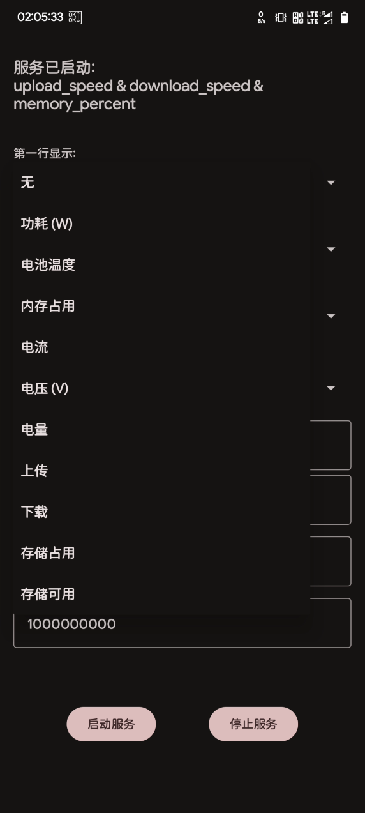
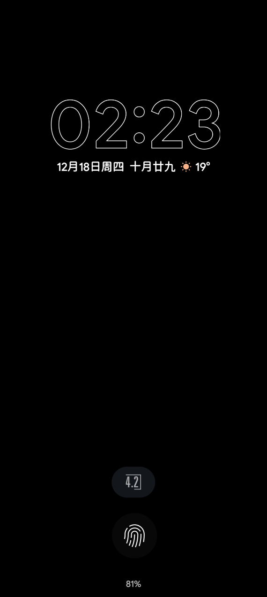

# 状态栏监控 (StatusBarMonitor)

一个简洁、高效、极轻量的 Android 系统监控工具。它通过动态生成的状态栏图标实时展示系统核心参数，无需悬浮窗权限，完美适配 AoD (熄屏显示) 场景。

> **小提示**：如果开启服务后通知触发震动/声音，请长按通知进入系统设置，将通知渠道的“提示音”和“震动”设为无或静默。

---

### 🌟 应用特性

- **状态栏图标集成**：使用通知图标绘图技术，不占用屏幕空间，不遮挡操作。
- **多维度监控**：
    - **实时功耗** (W) & **电流** (mA) / **电压** (V)
    - **内存占用百分比** & **已用内存**
    - **电池温度** & **剩余电量**
    - **网速监控** (上传/下载流量实时显示)
    - **存储统计** (已用空间百分比及剩余可用容量)
- **高度自定义**：支持自定义字体大小、行间距、左边距以及图标尺寸。
- **视觉增强**：可选“动态进度圆环”，实时反馈电量、内存或存储状态。
- **开机自启**：支持设备重启后自动恢复监控服务。
- **AoD 友好**：由于集成在状态栏，可随系统通知在熄屏显示（AoD）中低功耗展示。

### 📸 应用截图

|            主界面配置            |         状态栏/AoD 效果          |
|:---------------------------:|:---------------------------:|
|  |  |

---

### 🛠️ 安装与使用

1. **下载安装**：前往 [Releases](你的下载链接) 下载最新的 APK 文件。
2. **授予权限**：应用需要“通知”权限以显示图标，以及“开机启动”权限（可选）以实现自启。
3. **配置参数**：
    - 在主界面选择你希望在第一行和第二行显示的信息。
    - 根据屏幕像素密度调整“字体大小”和“图标尺寸”以达到最佳视觉效果。
4. **启动服务**：点击“启动服务”即可在状态栏看到实时信息。

---
### 📄 许可证

本项目基于 **MIT License** 开源。你可以自由地使用、修改和分发本代码。
